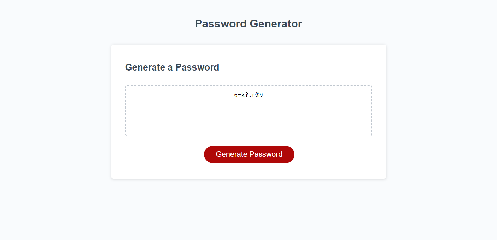

# Javascript Password Generator Challenge 

## Homework Details

In this work I was able to complete the code in the Javascript to have it generate a random password and display it. I started with creating multiple variables which help window prompts and confirms to get the users password preference. The variables also contained the letters, numbers, special characters, and two empty string variables. I then created if statements to fill one of the empty string var with the users answers. Finally, I created a for loop to randomize the value selection and fill the last empty string var with the selected values with a return command to display the password on the page. 

## Live Webpage 
https://elias-montes.github.io/Password-Generator-Challenge/

## Special Thanks 

A big thanks to Shawn Littrel for helping me in office hours

To stack overflow

To web docs

To google